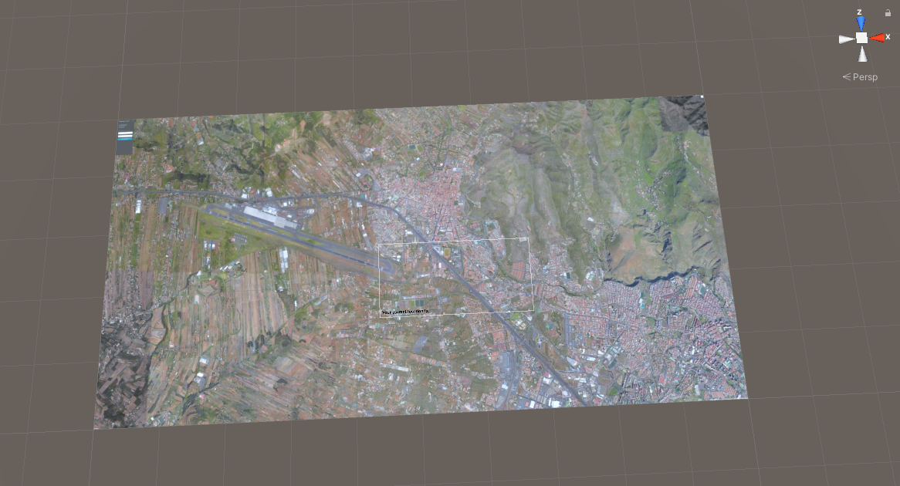

# Práctica 6 - Interfaces multimodales. Brújula, Acelerómetro y GPS

> Gabriel García Jaubert
>
> Universidad de La Laguna
>
> 13 de diciembre de 2021
>
> https://github.com/alu0101240374/II_P6.git

## Funcionamiento de la práctica

El entorno para la práctica consta de un mapa de La Laguna como se puede ver en la imagen:  



A través de este mapa es por donde navegaremos con nuestra cámara


## Brújula y GPS

Para ambas herramientas fue necesario activar la localización, una vez activada, las coordenadas del GPS son impresas en un canvas y la brújula controla la rotación de la cámara, para que así el mapa siempre esté mirando hacia la misma dirección.

```C#
Input.location.Start();

Input.compass.enabled = true;

transform.rotation = Quaternion.Lerp(transform.rotation, Quaternion.Euler(transform.eulerAngles.x, Input.compass.trueHeading, transform.eulerAngles.z), Time.deltaTime * 7);

```

## Acelerómetro

El acelerómetro es el controlador de la cámara sobre el mapa, dependiendo de la dirección en la que se incline el móvil, la cámara se moverá.

```C#
Vector3 dir = Vector3.zero;

    dir.x = Input.acceleration.x;
    dir.y = Input.acceleration.y;

    dir *= Time.deltaTime;

    transform.Translate(dir * speed);
```